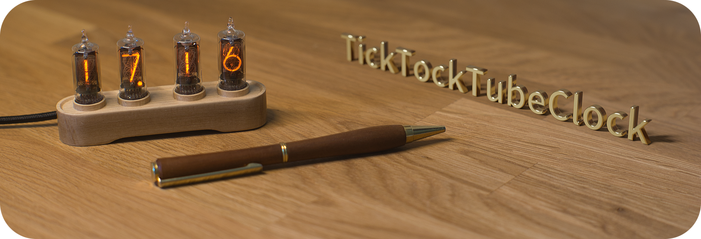
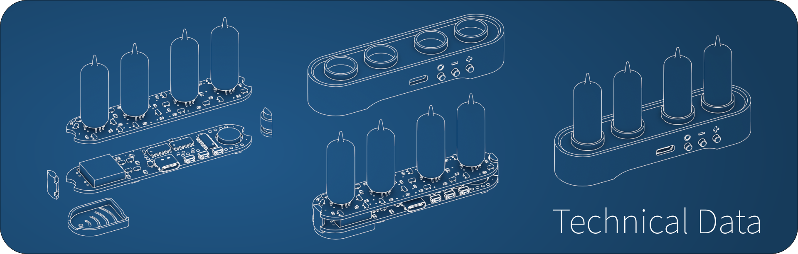

# TickTockTubeClock

The TickTockTubeClock is an open source, open hardware Nixie-Clock with pleasing aesthetics and rich functionality in mind. It combines old nixie tubes from the late sixties with modern miniaturized electronics, 3D printing and pretty advanced wood milling.  

## Background & Introduction
Back in 2020 I gained more and more interest in CNC machining as well as electronic engineering. Searching for a project to overcome lockdown during the pandemic, I stumbled upon an old, defective electrical calculator made by Canon in the late sixties (a Monroe 630, to be more precise - similar to [this one](https://www.oldcalculatormuseum.com/monroe620.html)). Luckily, all 14 Nixie tubes were in good shape, so I decided to make some clocks of them.

There are many different designs [out there](http://www.electricstuff.co.uk/nixiegallery.html). However, I felt most of them being a little bit too clumsy for the very small [CD81 Tubes from Hitachi](https://www.swissnixie.com/tubes/CD81/), that have been salvaged from the calculator. With the digits only being about 13 mm in height, I decided to design a housing that aesthetically complements these tiny tubes before actually thinking about how to get this thing to work electrically (not to mention to manufacture the housing). There just *had* to be a way to shrink down the electronics...

## Features
* Probably one of the smallest housings possible for a nixie tube that can be either *milled from wood* or *3D printed* using FDM or SLA printers
* Stacked two-PCB construction allows for easy adaption to other nixie tubes with same form factor
* Completely powered by a 5V USB-C connector
* Supercap based backup battery allowing to compensate power losses up to 36 hours
* Color-matched base light
* Sound output and ambient light sensor for automatic dimming
* Easy to program, extensible software interface
* Default firmware ships with:
  * Intuitive 3-button interface
  * Dimming tube and LED brightness (separately)
  * Adjustable ticking sounds
  * 4 different types of cross-fade effects (e.g. fade to black, crossfade)
  * 4 different types of ambient effects (e.g. sporadic flickering of tubes, misfiring effects)
  * Automatic night time dimming based on ambient light
  * Configurable off-time to save power and prolong tube life
  * Readout of temperature sensor of RTC
  * Anti cathode poisoning mode

# Technical Data & General Concept

The clock consist of multiple parts to achieve the small form factor:
* **Upper module:** The upper PCB mounts four nixie tubes as well as the switching electronics that allows to select the digit to be visible by means of a 5V logic signal. Current limiting is done on this module, making it relatively easy to re-design this PCB for different kinds of nixie tubes without needing to change the lower module.
* **Lower module:** The lower PCB hosts the microcontroller as well as some shift registers that allow to control individual digits. It also contains two high-side switches allowing to mux between two pairs of tubes. This not only reduces the complexity of the switching electronics, but also allows to dim the tubes by using pulse width modulation. Additionally, this board includes two cutouts for mounting the DC/DC converter and a 0.2 F supercapacitor without sacrificing the overall height of the module.
* **Spacers and touch protection:** These 3D printed parts seperate upper and lower module from each other to prevent accidential contact between electrical parts. This space is also needed to route a total of 25 insulated copper wires between both PCBs, transmitting logic as well as high voltage signals. The touch protection contains several holes to allow for some ventilation and prevents accidential contact with the exposed high voltage part of the electronics.
* **Case:** The case can either be made from hardwood or by 3D printing. In either case, the machining tools need to be quite precise since the material thickness ranges from only 0.75 mm to 2.0 mm.

 

| Mechnical specs. | | Electrical specs. | |
| - | -: | - | -: |
| Dimensions (width × depth × height) | 9.5 × 2.45 × 5.0 cm | Supply voltage | 5V |
| Weight | approx. xx g| maximum power consumption | 2.5 W |
| electrical components | 114 | Accuracy | ±2.6 minutes/year |

  

# Making your own & Prerequisites

Making the TickTockTubeClock is quite a time consuming endeavor and you will need some mechanical equipment as well as good soldering skills.

## Mechanical equipment
* **3D Printer:**
Either a FDM printer with a rather fine (0.2 mm) nozzle or a SLA printer is fine. The printer is mainly needed for some internal spacers as well as a cover for the high voltage electronics.
  * Theoretically, the whole case can be 3D printed. The result, however, won't be as pleasing as a milled case.
  * When ordered in bulk, using online services such as Shapeways or JLCPCB might be a viable option.   

* **CNC Mill:** The mill has to be quite precise but does not neet to be particularly large.
  * It is definitively possible to use a cheap 3018 style CNC mill (I actually did all parts on a slightly modified 3018!). However, you probably need to use very slow feeds, so milling the case out of hard wood will take *many* hours.
  * The 3D geometry to be milled is quite complex, so you will need a powerfull CAM tool for generating tool paths. I used Fusion 360 for CAD as well for CAM.  

* **Milling bits:**
  * 3 to 6 mm flat end mill (two flute, for wood) with at least 22 mm cutting edge length.
  * 2 mm flat end mill (two flute, for wood) for fine details.
  * 0.5 - 1 mm end mill for USB port and button cutouts on side.
  * V carve routing bit for details on side.

## Electronics
* **Components:** Please have a look at the Bill of Materials. (As soon as I uploaded it...)
* **DC/DC converter**: This is a tricky one, since we need a DC/DC converter with a large voltage ratio (5V -> 170V). I finally found a suitably small one on Aliexpress: [DKYB DC 5V-9V to 170V](https://www.aliexpress.com/item/32990383358.html).
* **Additional isolation:** To be on the save side when handling a device with high voltages, I heavily recommend to apply some conformal coating on the assembled PCB. I used a [acrylic based one](https://cramolin-shop.de/cramolin-plastik-400-ml-spraydose-1201611) with great results.
* **SMD soldering:** All components can be soldered by hand (mostly 0805, some 0603 footprints). There are, however, some delicate parts in the BoM that need a steady hand and good eyes (or a microscope). Especially the USON6 package of the [OPT3001](https://www.ti.com/lit/ds/symlink/opt3001.pdf?ts=1649591341957&ref_url=https%253A%252F%252Fwww.google.com%252F) ambient light sensor is quite challenging.

## Software
* The clock uses an ATMega 168 processor from microchip. The programming/flashing is done via PlatformIO.
* There just was not enough space for a USB to serial chip on the PCB, so a ISP programmer is needed for flashing the device.

 

**More information and some tutorials are coming soon...**