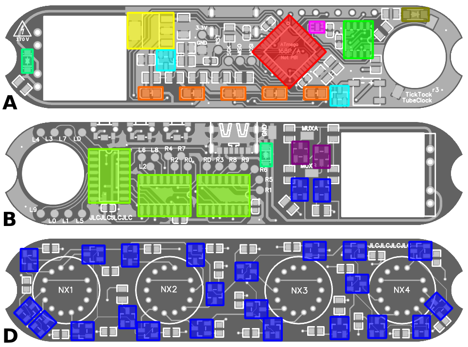
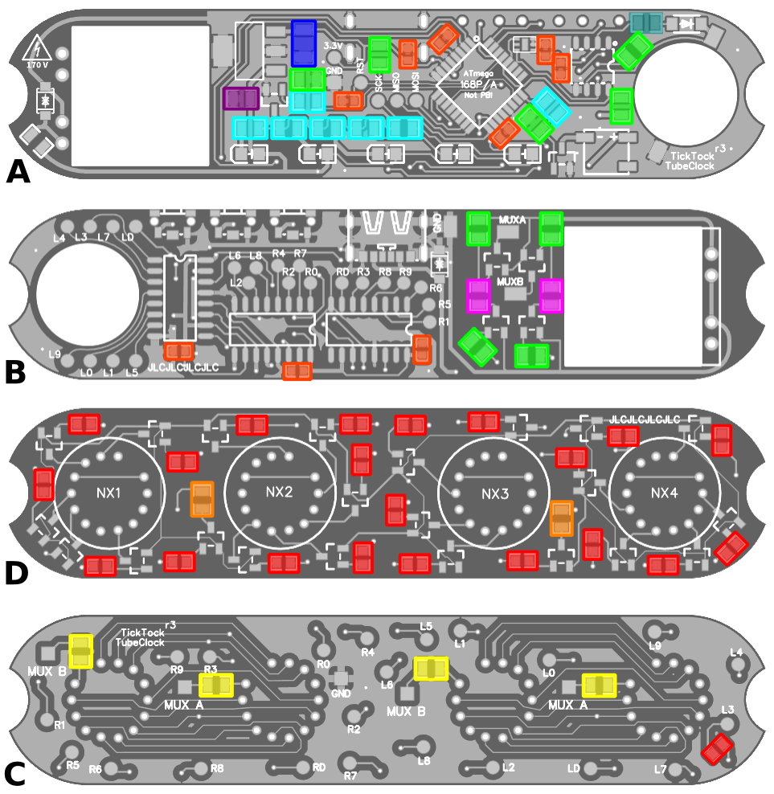
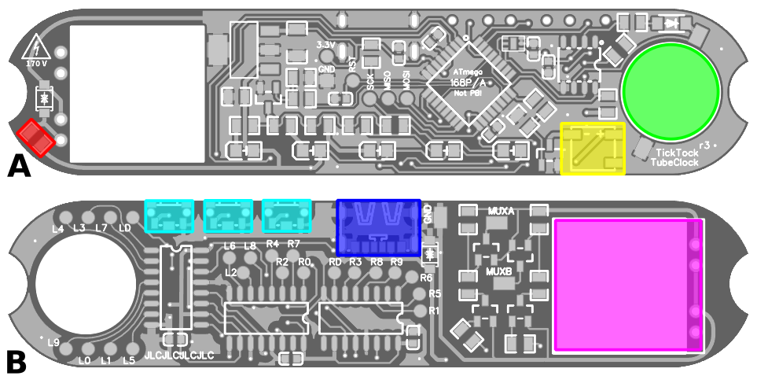

# Bill of Materials

There was simply not enough space on the PCB for proper designators. Instead, please consult the color-code besides the _No._ column and the respective images of the PCB.

Number column: 

**A** = Lower PCB / Lower side, **B** = Lower PCB / Upper side

**C** = Upper PCB / Lower side, **D** = Upper PCB / Upper side

### Integrated Circuits, Diodes & Mosfets

| No.                                                       | Qty | Package | Manufacturer      | Part number    | Description                                | Alternatives                                                                                                                        |
|-----------------------------------------------------------|-----|---------|-------------------|----------------|--------------------------------------------|-------------------------------------------------------------------------------------------------------------------------------------|
|  A1   | 1   | QFP32   | Microchip         | ATMEGA168-20AU | 8bit microcontroller                       | P variant is also okay, but **not -PB!**. ATMEGA328 if more memory is needed.                                                       |
|  A2   | 1   | SOT-223 | Texas Instruments | LM3940IMP-3.3  | Voltage regulator 3.3V                     | Any pin-compatible LDO proably will do. However, stabilizing capacitors need adjusment depending on data-sheet.                     |
|  A3   | 1   | SOIC-8  | Maxim Integrated  | DS3232MZ/V+    | Real time clock with integrated oscillator | DS3231MZ+, DS3231M (both untested) needs compatible footprint + internal oscillator                                                 | 
|  A4   | 1   | USON-6  | Texas Instruments | OPT3001DNPR    | Ambient light sensor                       | OPT3002 should work as well                                                                                                         |
|  A5   | 2   | SOT-23  | Diodes Inc.       | DMN2041L-7     | n-channel MOSFET                           | IRLML2502 or similar, needs a 3.3V logic level compatible Gathe-threshold voltage (< 1.5V)                                          |
|  A6   | 5   | 0805    | Würth Elektronik  | 150080AS75000  | LED Amber/Orange 2V/20mA                   | Any similar LED will do. Using a color matching the nixies closely recommended.                                                     |
|  A7   | 1   | SOD-123 | Nexperia          | BAT54GWX       | Schottky diode                             | Maybe RB168MM-40. **See description below**                                                                                         |
|  AB8  | 2   | SOD-123 | Eaton             | STS321050B331  | TVS diode                                  | Used for securing the USB port as well as the 5V input rail of the DC/DC convertor (in case of voltage spikes when malfunctioning). |
|  B9   | 3   | SOIC-16 | Texas Instruments | SN74HC595      | 8bit shift register                        |                                                                                                                                     |
|  B10  | 2   | SOT-23  | Various           | MMBTA92        | High voltage transistor, p-channel         |                                                                                                                                     |
|  BC11 | 24  | SOT-23  | Various           | MMBTA42        | High voltage transistor, n-channel         |                                                                                                                                     |

**Note on schottky diode (A7)**

This diode is used for charging the supercapacitor and needs special attention in order to maximize battery backup time:
Ideally, a diode is chosen with an extremely low forward voltage (so the maximum charging voltage of the supercap is near 3.3V) as well as a very low reverse current (preventing discharge over time).
After some quite extensive search, the BAT54GWX seems to be a reasonable choice. For a maximum voltage of 3.3V, the reverse current should be as low as 0.5 µA while the voltage drop should stay below 240 mV.
The current consumption of the RTC in backup mode typically is about 1.8 µA, so further reducing the reverse current of the diode should significantly prolong battery backup time.

Using the BAT54GWX, about 30-36 hours of backup time can be expected.  
**If you find a better diode, please tell me!**

### Capacitors & Resistors

| No.                                                        | Qty | Package | Description                                       | Annotations                                                                                                      |
|------------------------------------------------------------|-----|---------|---------------------------------------------------|------------------------------------------------------------------------------------------------------------------|
|  AB12  |  9  | 0603    | **C:** 100nF/50V X7R Generic decoupling capacitor | 16V rating should be also sufficient.                                                                            |
|  A13   |  1  | 0805    | **C:** 470nF/25V X7R capacitor                    | Needs to be matched with LDO specifications.                                                                     |
|  A14   |  1  | 1206    | **C:** 33µF/16V X5R capacitor                     | Needs to be matched with LDO specifications.                                                                     |
|  AB15  |  9  | 0805    | **R:** 10kΩ resistor 1/4W                         | Can be replaced with something in the 4-16kΩ range.                                                              |
|  A16   |  7  | 0805    | **R:** 150Ω resistor 1/4W                         |                                                                                                                  |
|  A17   |  1  | 0805    | **R:** 150Ω resistor 1/4W                         | For charging the supercap. Reduce value for faster charging, but shorter supercap life.                          |
|  B18   |  2  | 0805    | **R:** 1MΩ resistor 1/8W                          | Mega-Ohms! You really do not want milli Ohms here ;-)                                                            |
|  D19   |  2  | 0805    | **R:** 2.4kΩ resistor 2/5W                        | Controls relative brightness of decimal-dots. Might be varied to match better.                                   |
|  BC20  | 22  | 0603    | **R:** 10kΩ resistor 1/4W                         |                                                                                                                  |
|  C21   |  4  | 0805    | **R:** 16kΩ resistor 2/5W                         | In theory, these should be ~2W rated. However, due to multiplexing and PWM effective current is greatly reduced. |

### Other Components

| No.                                                       | Qty | Package | Manufacturer         | Part number                                              | Description                      | Alternatives                                                                                   |
|-----------------------------------------------------------|-----|---------|----------------------|----------------------------------------------------------|----------------------------------|------------------------------------------------------------------------------------------------|
|  A22  | 1   | 0603    | Bourns               | SF-0603HI075F-2                                          | Fuse 750mA High Inrush Withstand | 500mA might be sufficient as well. Needs long-time testing. 0Ω jumper if you feel adventurous. |
|  A23  | 1   | special | CUI Devices          | CMT-5023S-SMT-TR                                         | Magnetic Buzzer                  | KELIKING KLJ-5018 is cheaper but sounds worse.                                                 |
|  A24  | 1   | special | Various              |                                                          | Super Capacitor >3.3V            | **See description below**                                                                      |
|  B25  | 3   | special | Diptronics           | TCD-C2KQR                                                | Right angle tactile switch       |                                                                                                |
|  B26  | 1   | special | Korean Hroparts Elec | TYPE-C-31-M-16                                           | USB-C Power-only jack            |                                                                                                |
|  B26  | 1   | THT     | DKYB                 | [Link](https://www.aliexpress.com/item/32990383358.html) | 5V to 170V DC/DC converter       | If you are able to design a on-board circuit, please contact me!                               |

**Note on supercapacitor (A24)**

Any supercapacitor with (at least) 3.3V will be fine. Use a higher voltage one and/or larger values for A17 to prolong its life expectancy.
The PCB originally has been designed to hold a *5V/0.1F Eaton Gold Cap* (10mm diameter, 4mm height), but slightly larger ones should also fit (max. diameter 12mm, max. height about 6mm).
With 0.1F capacity, one can expect about 30h of timekeeping if USB power is lost.
Choosing a hibrid capacitor, like the Vishay MAL219691203E3 (should barely fit), with 15F/4.2V a total of 60 days should be possible. However, I am unsure regarding the life expectancy of the cell and its self discharging properties.
